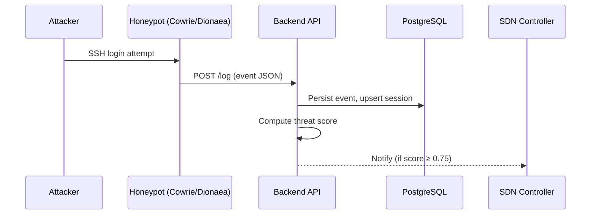

# Honeypot Integration

## What Is a Honeypot?

A honeypot is a fake service that looks like a real target (an SSH server, a web form, a database port). It has no legitimate users. Anyone who interacts with it is either a scanner, an attacker, or a misconfigured device.

EvilTwin uses two honeypots:

| Honeypot | What It Simulates | Events It Generates |
|---|---|---|
| **Cowrie** | SSH and Telnet server | Login attempts, commands run, files downloaded |
| **Dionaea** | SMB, FTP, HTTP (malware trap) | Port probes, exploit attempts, payload captures |

Both honeypots detect activity and forward structured events to the EvilTwin backend via `POST /log`. The backend aggregates events into sessions, computes threat scores, and triggers alerts when scores are high.

:::note
The `/log` ingest endpoint does **not** require JWT authentication. Honeypots run inside the container network and cannot hold tokens. Network isolation (the `internal` Docker network) is the security control here — `/log` is never exposed on the public interface.
:::

---

## Architecture: How Events Flow



---

## Session Identity

All events from a single attacker are grouped into a session. The session is identified by a combination of fields:

| Field | Source | Notes |
|---|---|---|
| `source_ip` | Attacker's IP | Primary grouping key |
| `sensor_id` | Hostname of the honeypot container | Distinguishes cowrie from dionaea |
| `protocol` | `"ssh"`, `"ftp"`, `"smb"`, etc. | Part of session context |
| `session_id` | Honeypot's internal session UUID | Optional — used for per-connection granularity |

Session boundaries:
- A new session is created when a new `(source_ip, sensor_id)` pair is seen
- Events from the same attacker across multiple honeypots create **separate sessions** (one per sensor)
- Session updates continue until the honeypot reports the connection closed

---

## Event Schema

```json
{
  "source_ip": "203.0.113.7",
  "sensor_id": "cowrie-1",
  "protocol": "ssh",
  "event_type": "login_attempt",
  "username": "admin",
  "password": "1234",
  "command": null,
  "filename": null,
  "timestamp": "2024-01-15T10:22:33Z",
  "session_id": "a4c3b2d1-..."
}
```

**Required fields:** `source_ip`, `sensor_id`, `protocol`, `event_type`, `timestamp`

**Optional fields:** `username`, `password`, `command`, `filename`, `session_id`

Event types:

| `event_type` | Honeypot | Meaning |
|---|---|---|
| `login_attempt` | Cowrie | Attacker tried a username/password |
| `login_success` | Cowrie | Attacker's credentials were accepted (by the fake shell) |
| `command` | Cowrie | Attacker ran a command in the fake shell |
| `file_download` | Cowrie | Attacker downloaded a file (possible payload) |
| `probe` | Dionaea | Port scan or protocol probe |
| `exploit_attempt` | Dionaea | Known exploit signature matched |
| `payload_capture` | Dionaea | Malware binary or shellcode captured |
| `connection_closed` | Both | Connection terminated |

---

## Integration Patterns

### Pattern A — Cowrie JSON Log Forwarder

Cowrie writes JSON event files to `/var/log/cowrie/cowrie.json`. A lightweight Python forwarder (`cowrie/log_forwarder.py`) tails this file and POSTs each line to `/log`:

```python
import json, time, requests

LOG_PATH = "/var/log/cowrie/cowrie.json"
BACKEND_URL = "http://backend:8000/log"

with open(LOG_PATH) as f:
    f.seek(0, 2)  # seek to end
    while True:
        line = f.readline()
        if line:
            event = json.loads(line)
            requests.post(BACKEND_URL, json=map_cowrie_event(event))
        else:
            time.sleep(0.5)
```

The `map_cowrie_event()` function translates Cowrie's field names to the EvilTwin schema.

### Pattern B — Dionaea REST Webhook

Dionaea supports HTTP POST webhooks natively. Configure `dionaea.cfg` to POST to the backend:

```ini
[module dionaea.modules.python.virustotal]
# Not used — EvilTwin handles payload analysis

[module dionaea.log.json]
url = http://backend:8000/log
```

The Dionaea event payload is automatically mapped to the EvilTwin schema by the backend ingest handler.

### Pattern C — Canary Token Webhook

Canarytokens.org tokens (or self-hosted Canary appliances) generate a webhook when a token is triggered (e.g., a fake AWS key is used, or a PDF is opened).

Canary webhooks use a separate endpoint (`POST /canary/webhook`) with HMAC-SHA256 signature verification:

```bash
# Example signed canary event
curl -X POST http://backend:8000/canary/webhook \
  -H "X-Canary-Signature: sha256=<hmac_hex>" \
  -H "Content-Type: application/json" \
  -d '{"token_id":"abc123","src_ip":"203.0.113.7","kind":"aws-id"}'
```

The backend verifies the HMAC using `CANARY_WEBHOOK_SECRET`, rejects replayed requests (timestamp within `CANARY_WEBHOOK_TOLERANCE_SECONDS`), and injects the event into the session stream.

:::tip Canary token strategy
Deploy one canary token per sensitive resource class: a fake admin SSH key, a fake S3 bucket credential, a fake database URL. Any trigger is a high-confidence indicator of compromise — canary events are automatically scored at maximum threat level.
:::

---

## Reliability Checklist

Before going live, verify:

- [ ] Honeypot container sends events to `http://backend:8000/log` (not `localhost`)
- [ ] `POST /log` is reachable from within the Docker internal network
- [ ] `POST /log` is **not** exposed on the host machine (check `docker-compose.yml` port bindings — `8000` should only be on `127.0.0.1`)
- [ ] Honeypot `sensor_id` is unique and descriptive (`cowrie-dmz`, `dionaea-prod`, etc.)
- [ ] Cowrie `cowrie.cfg` sets `log_json = true` (required for the log forwarder)
- [ ] Canary webhook secret is set in `.env` (`CANARY_WEBHOOK_SECRET=...`)
- [ ] Events appear in `GET /sessions` within 5 seconds of a simulated trigger

---

## Verification Procedure

**Step 1 — Start services:**
```bash
docker compose up -d
```

**Step 2 — Acquire a JWT token:**
```bash
TOKEN=$(curl -s -X POST http://localhost:8000/auth/login \
  -H "Content-Type: application/json" \
  -d '{"email":"analyst@example.com","password":"yourpassword"}' \
  | jq -r '.access_token')
```

**Step 3 — Simulate an SSH brute-force:**
```bash
# Send 5 login attempt events from the same IP
for i in {1..5}; do
  curl -s -X POST http://localhost:8000/log \
    -H "Content-Type: application/json" \
    -d "{\"source_ip\":\"10.99.0.$i\",\"sensor_id\":\"cowrie-test\",\"protocol\":\"ssh\",\"event_type\":\"login_attempt\",\"timestamp\":\"$(date -u +%Y-%m-%dT%H:%M:%SZ)\",\"username\":\"root\",\"password\":\"password$i\"}"
done
```

**Step 4 — Verify session was created:**
```bash
curl -s http://localhost:8000/sessions \
  -H "Authorization: Bearer $TOKEN" | jq '.items[0]'
```

Expected: session from `10.99.0.1` (the lowest IP, first event), with `event_count = 5` or higher if ML scoring ran.

**Step 5 — Verify threat score:**
```bash
curl -s http://localhost:8000/score/10.99.0.1 \
  -H "Authorization: Bearer $TOKEN" | jq .
```

Expected: `score > 0` with `threat_level` of `low` or higher.
